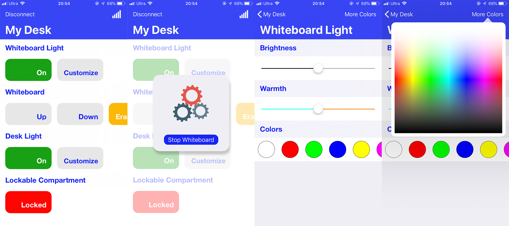

    

# Smart Desk
App :iphone: to remotely control a smart desk. IED Project for team Hexapi, Fall 2018 @ RPI.

## Introduction
This app harnesses the power of BLE to remotely control a smart home accessory catered to college students' needs. For it to function correctly, the desk needs to be set up with [electronics by the Arduino](https://github.com/ljw980105/SmartDesk-Arduino).

## Features
* Remotely control two light strips, one located beneath the desktop, one located above the whiteboard.
    * The light strip's brightness, color temperature and color can be customized.
* Remotely control the motor which moves the whiteboard up and down.
* Remotely turn on/off the motor to erase what's on the whiteboard.
* Remotely locks/unlocks a lockable compartment. Requires `Touch ID` or `FaceID`.

## Frameworks Used
* `CoreBluetooth`
* `CoreData`
* `LocalAuthentication`
* `Lottie` from the awesome folks at Airbnb
* `SwiftMessages`

### Thanks for stopping by! :)
